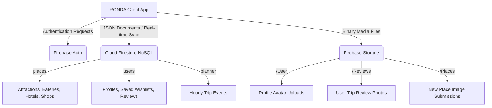
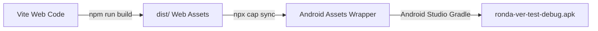

# RONDA Travel Companion App — Technical Report & Project Overview

This document provides a comprehensive technical overview of the **RONDA** travel companion application, detailing the architecture, technology stack, data models, processing pipelines, and mobile packaging workflows.

---

## 1. Executive Summary & App Concept

**RONDA** is a premium, localized travel companion application designed to assist travelers in Malaysia (focusing on regions like Kuala Lumpur, Selangor, Penang, Putrajaya, and Negeri Sembilan). The application serves as an interactive travel directory, itinerary planner, and personalized tour guide. 

### Key Features:
*   **Secure Authentication**: Secure user sign-up/login, Google Popup Auth integration, username uniqueness validation, and security email verification link workflows.
*   **Smart Discovery Directory**: Categorized exploration of destinations divided into four travel categories: **Eateries** (Tempat Makan), **Shop** (Beli-belah), **Activity** (Aktiviti), and **Hotel** (Penginapan).
*   **Dynamic Interactive Mapping**: Built-in Google Maps dashboard showing GPS user geolocations, custom color-coded category markers, and interactive info windows linked to place profiles.
*   **Gemini AI Chatbot (RONDA Bot)**: A bilingual travel assistant trained on local destinations that dynamically plans customized single/multi-day itineraries based on user constraints (interests, accessibility, and budget) and allows direct itinerary transfers to the calendar.
*   **Hourly Trip Planner & Wishlist**: An interactive calendar grid and hourly schedule builder (08:00 to 22:00) that integrates with a saved wishlist ("Plan Now" shortcuts) to organize trip logs.
*   **User Profiles & Place Submissions**: Settings control panel enabling users to upload profile pictures, manage reviews, edit settings, and submit new places to Firestore.

---

## 2. Software Architecture & Technology Stack

The application uses a hybrid web-to-mobile architecture, utilizing modern frontend frameworks bundled with Google Firebase cloud services and packaged into native Android containers.

### Languages
*   **JavaScript (ES6+)**: Powers the application logic, React component lifecycle, state management, Firebase client queries, and Gemini generative AI API requests.
*   **HTML5**: Provides semantic layout structures (`<main>`, `<header>`, `<nav>`, etc.) for high accessibility and SEO compliance.
*   **CSS3 (Vanilla CSS)**: Controls the visual layer using CSS custom properties (variables) to support smooth light/dark mode transitions, fluid layout calculations, and premium micro-animations.
*   **Python**: Used for backend data engineering, spreadsheet extraction, coordinate parsing, and image asset pre-processing.

### Frameworks & Libraries
*   **Vite**: The build tool and bundling engine, utilizing Rollup chunking rules to separate third-party libraries (Firebase, Gemini) into optimized vendor assets for speed.
*   **React (v18+)**: The UI rendering library, coordinating real-time UI updates via states (`useState`), side-effects (`useEffect`), memoization (`useCallback`), and Context APIs (`useAuth`, `useTheme`, `useLanguage`).
*   **React Router DOM**: Orchestrates client-side routing, query parameter parsing, and session guard redirects (preventing unauthenticated or unverified users from accessing home screens).
*   **Google Generative AI SDK (`@google/generative-ai`)**: Interfaces with the `gemini-flash-latest` model to handle generative prompt requests directly from the client.
*   **Google Maps JS SDK**: Renders maps, overlays coordinates, registers click actions, and tracks live GPS coordinates using browser Geolocation.
*   **Dicebear Avatars API**: Dynamically generates unique, colorful user avatars on-the-fly based on username seeds.

---

## 3. Database, Cloud Storage & Authentication

The backend is powered by **Google Firebase**, providing real-time data streaming, user validation, and file storage.



### Cloud Services Used:

#### 1. Firebase Authentication (Auth Service)
*   **Purpose**: Manages user identity verification, credential security, session persistence, and account recovery workflows.
*   **Deep-Dive Technical Architecture & Lifecycles**:
    *   **User Registration & Uniqueness Safeguards**:
        When a traveler registers a new account, the frontend captures their email, password, and desired username. Because standard Firebase Auth only ensures email uniqueness natively, the app runs a custom validation layer. It queries a Firestore check collection `usernames/{cleanUsername}` using `isUsernameUnique()`. If the username is already taken, registration is blocked. If unique, it executes `createUserWithEmailAndPassword(auth, email, password)`, triggers `firebaseUpdateProfile` to set the Auth display name, and writes a locking mapping document to `usernames/{cleanUsername}` mapped to the user's unique Firebase Auth `uid`.
    *   **Secure Verification Workflows (Anti-Spam Controls)**:
        Immediately following user creation, the system triggers `sendEmailVerification(user)`. This sends an automated email containing an action link powered by Firebase's secure mail servers. In addition, the system implements account lifecycle security protocols:
        *   *Password Resets*: Uses `sendPasswordResetEmail(auth, email)` to email a secure reset link, validating the user's identity out-of-band.
        *   *Email Changes*: Uses `verifyBeforeUpdateEmail(user, newEmail)` to send a confirmation link to the *new* email address. The address is only updated on the Auth profile after the link is clicked, preventing account lockouts due to typo errors or hijacking.
    *   **Federated Identity Integration (Google OAuth)**:
        For seamless onboarding, the application integrates Google Sign-In via `signInWithPopup(auth, googleProvider)`. If the Google identity token belongs to a new user, the system automatically sanitizes their display name (removing spaces and special characters) and runs a loop that appends an incremental numeric counter (e.g. `user1`, `user2`) until it finds a unique username key. It then registers the mapping and creates their profile document in Firestore.
    *   **Global State Management & Real-time Profile Synchronization**:
        The authentication state is monitored globally using the `onAuthStateChanged` observer. The application wraps this state in a custom React context (`AuthContext.jsx`). Once a user signs in, the context initiates a real-time database listener using Firestore's `onSnapshot(doc(db, 'users', uid))` instead of a single fetch. This ensures that changes to the user's profile (like a new profile photo or adding/removing liked places) synchronize instantly across the entire application interface in real time (e.g., liking a place instantly populates it in the planner tab without requiring page refreshes).

#### 2. Cloud Firestore (NoSQL Database)
*   **Purpose**: Houses structured data collections.
*   **Key Implementations**: Uses security rules to enforce validation (e.g., username lookup collections) and runs on-demand background batch writes to seed places to the database. Specifically, on client-side startup/auth changes, the seeder compares version IDs and, if a dataset update is required, wipes old entries and writes the 496 unique destinations using Firestore `writeBatch` transactions chunked at 400 documents per batch to safely bypass Firestore's 500-operation transaction cap. This entire operation runs fully asynchronously to prevent freezing the UI.

#### 3. Firebase Storage (Cloud Bucket)
*   **Purpose**: A high-performance, globally distributed object storage bucket for hosting raw binary files, specifically user profile avatars, review pictures, and custom place images.
*   **Mobile-to-Cloud Upload Pipeline (Capacitor File Bridge)**:
    Since the application runs inside a hybrid mobile container (via Capacitor) and standard web pages, it bridges device hardware (camera and gallery) with the cloud.
    1.  **Image Capture**: The device camera or photo picker yields a local file path (e.g., `file://...` or `content://...` on Android) or a Base64-encoded string.
    2.  **Blob Conversion**: To send this data over HTTP/HTTPS, the React frontend converts the path or Base64 string into a standard JavaScript `Blob` or `File` object using a fetch request (`fetch(imageUri).then(r => r.blob())`).
    3.  **Storage Reference Resolution**: The app initializes a path pointer using `ref(storage, 'Folder/filename')`.
    4.  **Transfer & Download URL Mapping**: The file is uploaded asynchronously via `uploadBytes`. Upon successful completion, the client triggers `getDownloadURL(storageRef)` to obtain a publicly signed HTTPS URL, which is then stored in the corresponding Firestore user profile or review document.
*   **Granular Security Policies & Access Control Rules (`storage.rules`)**:
    To protect the bucket from unauthorized storage usage, script injections, and cross-user modifications, the bucket enforces specific matching rules:
    ```javascript
    rules_version = '2';
    service firebase.storage {
      match /b/{bucket}/o {
        // Rule 1: User Avatars
        match /User/{userId} {
          allow read: if true;
          allow write: if request.auth != null && request.auth.uid == userId;
        }
        match /User/{userId}/{allPaths=**} {
          allow read: if true;
          allow write: if request.auth != null && request.auth.uid == userId;
        }
        // Rule 2: Review Photos
        match /Reviews/{allPaths=**} {
          allow read: if true;
          allow write: if request.auth != null;
        }
        // Rule 3: Custom Places
        match /Places/{allPaths=**} {
          allow read: if true;
          allow write: if request.auth != null;
        }
      }
    }
    ```
    *   **Rule Analysis**:
        *   `allow read: if true`: Configured across all folders to ensure that image files load instantly for anyone browsing the app without the overhead of generating time-limited access tokens.
        *   `request.auth.uid == userId`: Restricts write access for profile avatars to the specific user who owns that directory. User A cannot overwrite or delete User B's profile picture because their authenticated UID must match the `{userId}` wildcard in the URL path.
        *   `request.auth != null`: Restricts the creation of review images (`/Reviews`) and custom place submissions (`/Places`) to authenticated users, protecting the cloud bucket from unauthorized uploads by automated bots.

---

## 4. Data Models & Entities Schema

The NoSQL schema is structured into three primary collections:

### 1. `places` (Destination profiles)
```json
{
  "id": "local_place_0",
  "title": "SuperPark Malaysia",
  "categoryName": "activity",
  "address": "Unit 4-1, Level 4, Avenue K, 50450 Kuala Lumpur",
  "state": "Kuala Lumpur",
  "location": { "lat": 3.1619885, "lng": 101.7148269 },
  "totalScore": 4.9,
  "reviewsCount": 11631,
  "imageUrl": "/data/images_activity_in_ampang_jaya/SuperPark_Cover.jpg",
  "description": "SuperPark Malaysia is an indoor playground. Price: RM22/hour...",
  "reviews": [
    {
      "id": "rev_0_1",
      "reviewerName": "Farahana Hussain",
      "reviewerPhotoUrl": "https://api.dicebear.com/7.x/adventurer/svg?seed=Farahana",
      "rating": 5,
      "text": "Great experience with a lot of indoor excellent games...",
      "publishAt": "Recently",
      "isLocalGuide": true,
      "images": ["/data/images_activity_in_ampang_jaya/review_photo.jpg"]
    }
  ],
  "amenities": ["Located in Kuala Lumpur", "Free Wi-Fi", "Ample parking"],
  "accessibility": ["Wheelchair accessible entrance", "Family friendly"],
  "interest": ["Activity", "Cultural sightseeing"],
  "createdAt": "2026-06-05T00:00:00Z"
}
```

### 2. `users` (User profiles & activity logs)
```json
{
  "uid": "user_auth_id_123",
  "email": "user@example.com",
  "username": "hazim_ronda",
  "photoURL": "https://firebasestorage.googleapis.com/.../User/user_auth_id_123",
  "likedPlaces": ["local_place_0", "local_place_5"],
  "addedPlaces": ["local_place_150"],
  "myReviews": [
    {
      "reviewId": "rev_12345",
      "placeId": "local_place_0",
      "placeTitle": "SuperPark Malaysia",
      "rating": 5,
      "text": "Amazing place!",
      "createdAt": "2026-06-05T02:00:00Z"
    }
  ],
  "createdAt": "2026-06-05T01:00:00Z"
}
```

### 3. `planner` (Schedule coordinates)
```json
{
  "id": "planner_event_987",
  "uid": "user_auth_id_123",
  "date": "2026-06-05",
  "time": "10:00",
  "title": "Visit SuperPark Malaysia",
  "placeId": "local_place_0",
  "createdAt": "2026-06-05T01:30:00Z"
}
```

---

## 5. Data Cleansing & Asset Processing Pipelines

To ensure premium visuals and data integrity, data is processed through custom pipelines before being deployed.

### A. Data Cleansing Pipeline (Excel to JSON)
Raw travel records were scattered across **36 distinct Excel (`.xlsx`) files** containing duplicate entries, missing coordinates, and inconsistent paths. A Python data-pipeline [excel_to_json.py](file:///C:/Users/AIN%20MARDIAH/.gemini/antigravity/brain/2d5de34b-826b-41a3-a1d8-3025065cac30/scratch/excel_to_json.py) was built to execute the following steps:
1.  **Deduplication**: Performed case-insensitive text matching on destination titles to eliminate duplicates, reducing the raw entries to **496 unique locations**.
2.  **Coordinate Extraction**: Extracted latitude and longitude values from Google Maps sharing URLs using regex matches (e.g. `@(-?\d+\.\d+),(-?\d+\.\d+)`). When missing, it generated randomized offsets near the city center of the listed location to prevent coordinate stacking.
3.  **Local Image Mapping**: Corrected backslashes (`\`) to web-standard forward slashes (`/`) and mapped all local asset image fields to the public directory relative paths (e.g. `/data/images_folder/filename.jpg`), enabling instant local file retrieval.
4.  **Review Processing**: Mapped review parameters (reviewer names, text, ratings) and associated review image arrays, outputting the final dataset to `public/data/places.json`.

### B. Image Preprocessing & Transparency Pipeline
To match mockup designs, PNG icons (such as chatbot avatars and heart icons) were processed to remove solid backgrounds:
1.  **Color Filtering**: Scanned the source image pixels using a Python script. If pixels matched solid background colors (e.g. brown `#372018` or off-white `RGB >= 200`), their Alpha transparency channel was set to `0` (transparent).
2.  **Outline Preservation**: Preserved line drawing assets to ensure clean blending with various color themes without solid boxing artifacts.

---

## 6. Mobile Application Packaging & APK Conversion

The compiled Vite React application is converted into a native mobile installation package (`.apk`) using **Capacitor** and **Android Studio**.



### Steps in the packaging workflow:
1.  **Web Bundling**:
    Running `npm run build` triggers the Vite bundler to compile, minify, and output clean HTML, CSS, and optimized JavaScript code blocks into the target `dist/` directory.
2.  **Asset Sync**:
    Running `npx cap sync` triggers Capacitor to copy the bundled files from `dist/` directly into the Android native assets folder (`android/app/src/main/assets/public/`) and updates native plugin configurations.
3.  **Android Studio & Gradle Build**:
    *   **App Icon Adaptation**: Generates adaptive Android legacy (`ic_launcher.png`) and round (`ic_launcher_round.png`) launcher icons for all screen densities (`mdpi` up to `xxxhdpi`) placing the white logo over a solid dark brown theme background (`#372018`).
    *   **AGP Configuration**: Includes ProGuard file optimizations (`proguard-android-optimize.txt`) inside Gradle configurations to compress application footprints.
    *   **Custom Build Naming**: Configures Android build variants inside `build.gradle` to automatically rename output compilation files to `ronda-ver-test-debug.apk` (and `ronda-ver-test-release.apk` for release builds), ready for direct installation on mobile devices.

---

## 7. Project Limitations

While the RONDA application represents a fully functional mobile prototype, several technological constraints and architectural limitations have been identified:

1.  **Network Dependency & Service Degradation in Offline Zones**:
    As a cloud-first application, critical components—including Firebase Authentication, Firestore databases, and live Google Maps API renders—depend entirely on active internet connectivity.
    *   *Impact*: While Firestore offers local caching (allowing users to view cached profile settings), the Gemini AI chatbot, live Geolocation tracking, and map tile rendering fail or degrade when travellers enter remote or low-connectivity areas (e.g., national parks, rural rainforests, or high-altitude regions in Malaysia).
2.  **Client-Side API Architecture & Security Vulnerabilities**:
    The application directly integrates the Google Generative AI SDK (`@google/generative-ai`) on the client side to communicate with the `gemini-flash` model.
    *   *Security Concerns*: Embedding API keys or calling LLMs directly from client-side code exposes the key to reverse-engineering. Furthermore, chat histories are currently kept in ephemeral React component states. If the user closes or swip-closes the application, their entire conversational context is wiped, preventing them from resuming previous conversations.
3.  **Static Dataset Freshness & Lacked Real-time Synchronization**:
    The travel directory contains **496 curated destinations** seeded directly from a static Excel dataset.
    *   *Maintenance Overheads*: Place descriptions, user ratings, operating hours, prices, or closure statuses are fixed at the initial seed date. The application lacks an automated backend microservice to synchronize reviews, star ratings, or opening status changes from live APIs (like Google Places API) in real time.
4.  **Hardware Geolocation Precision & Urban Multipath Interference**:
    The Discovery dashboard relies on the HTML5/Capacitor Geolocation API to fetch device coordinates.
    *   *Accuracy Fluctuations*: In highly dense urban corridors (such as the KLCC area surrounded by massive skyscrapers) or indoor shopping complexes (like Avenue K or Mid Valley Megamall), GPS signals suffer from multipath interference. This results in positioning drift and inaccurate calculations for distance-based sorting or "places near me" recommendations.

---

## 8. Recommendations for Future Development

To address the identified limitations and elevate RONDA to a commercial, production-ready standard, the following engineering enhancements are recommended:

1.  **Transition to a Serverless API Gateway**:
    Migrate the Gemini AI integration to a backend layer using **Firebase Cloud Functions** (Node.js/Python serverless environment).
    *   *Benefits*: This hides all API credentials and allows developers to manage prompt system instructions, restrict API requests through server-side rate-limiters (like Redis or rate-limit rules), and save chat logs securely under `users/{uid}/chats/` in Firestore for persistent multi-device session history.
2.  **Graph-Based Route Optimization & Routing Algorithms**:
    Integrate the **Google Maps Directions API** and **Distance Matrix API** with the user's hourly trip planner.
    *   *Implementation*: Instead of sorting scheduled destinations chronologically by entry, the application can run path-finding algorithms (such as the nearest-neighbor heuristic or 2-opt search for the Travelling Salesperson Problem) to dynamically optimize the user's route. The app can auto-arrange destinations to minimize travel time, fuel costs, and detours based on live traffic data.
3.  **Advanced Progressive Caching & Offline Database Synchronization**:
    Implement offline databases utilizing **WatermelonDB** or Firestore's advanced offline persistence layers (`enableIndexedDbPersistence()`).
    *   *Implementation*: Leverage Workbox or Service Workers to pre-cache primary CSS, JS, HTML, and local icon bundles. Map vector tiles can be cached locally, allowing travelers to search local categories and view their itineraries even when cell towers are out of reach.
4.  **Capacitor Native Plugin Ecosystem Expansion**:
    Upgrade the mobile user experience by wrapping native hardware features:
    *   **Native Push Notifications**: Configure `@capacitor/push-notifications` to send real-time alerts (e.g. "Your scheduled activity at SuperPark starts in 15 minutes!").
    *   **Local Reminders**: Integrate `@capacitor/local-notifications` to trigger alarms even when the app is killed or offline.
    *   **Biometric Security**: Use `@capacitor-community/biometric-auth` to allow fast logins via fingerprint or facial recognition.

---

## 9. Entrepreneurial & Commercialization Opportunities

RONDA has been designed with multiple commercialization vectors, allowing it to transition from a student project into a profitable, smart-tourism startup:

1.  **B2B Sponsored Merchant Marketplace**:
    Introduce a dedicated B2B portal where local businesses (restaurants, souvenir shops, boutique hotels, activity venues) can claim and manage their profiles.
    *   *Revenue Model*: Merchants pay a monthly subscription fee to boost their visibility. Sponsored businesses would receive premium cards at the top of search listings, highlighted map pins, or be directly suggested by the Gemini AI chatbot when users ask for generic recommendations (e.g. "Find me the best local dessert spot").
2.  **Affiliate Booking API Integrations**:
    Integrate deep links and affiliate SDKs from travel aggregators such as **Klook**, **Agoda**, **Grab**, and **OpenTable**.
    *   *Revenue Model*: When a traveler schedules an activity (like visiting SuperPark Malaysia) or plans a dinner event, the app can display direct booking buttons ("Book Tickets on Klook" or "Book a Grab ride"). The platform would collect an affiliate commission (ranging from 3% to 8%) on every transaction completed through these referral links.
3.  **Premium Curated Content & Influencer SaaS**:
    Create a marketplace for verified travel guides, local historians, and lifestyle influencers to sell curated itinerary packages.
    *   *Revenue Model*: Integrate an in-app purchase gateway where users pay a one-time fee to unlock specialty itineraries (e.g., "Negeri Sembilan Culinary Heritage Tour" or "Penang Street Art Walk"). The platform would take a transaction commission (e.g. 20%) on each sale, creating a self-sustaining content marketplace.
4.  **Collaborative Social Planning SaaS (Group Travel Subscription)**:
    Introduce "RONDA Pro," a premium subscription tier ($3.99 - $5.99/month) featuring collaborative trip coordination tools.
    *   *Revenue Model*: Allow groups, families, or corporate teams to plan itineraries together in real-time with synchronized changes. Pro features would include shared wishlist boards, a real-time chat room, and an integrated expense ledger (similar to Splitwise) to log, split, and settle trip costs via local gateways (FPX, Touch 'n Go, or Stripe).

---

## 10. Project Summary & Conclusion

**RONDA** represents a modern, highly responsive travel companion application that successfully bridges local travel data directories with artificial intelligence. By unifying a clean React architecture, the Capacitor mobile wrapper, and the Firebase cloud ecosystem, the app delivers secure email-verification authentication, real-time data sync, a dynamic mapping directory, and an AI-driven bilingual assistant (RONDA Bot).

In conclusion, this project demonstrates the feasibility of constructing a lightweight, scalable, and highly interactive travel companion without heavy backend infrastructure. By resolving local dataset formatting anomalies, establishing strict storage rules, and utilizing Google's Gemini Flash model, RONDA stands as a premium framework for modern, localized smart tourism applications. It provides a foundation that can easily be commercialized into a feature-rich, revenue-generating startup.
